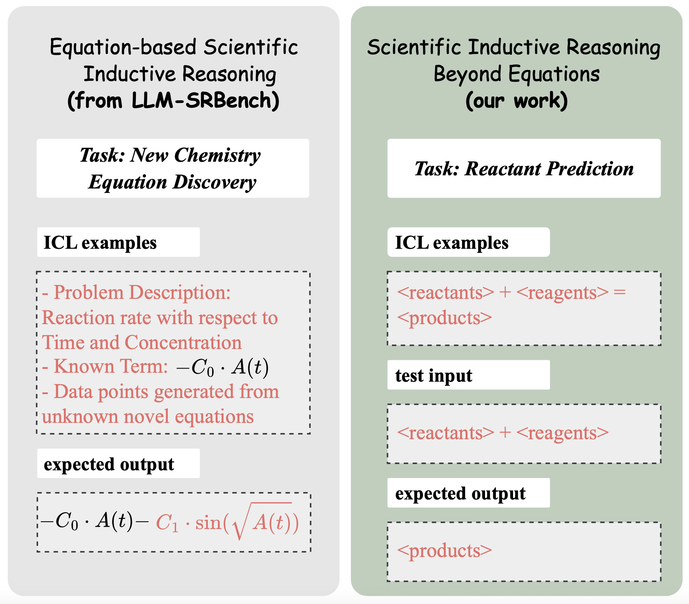

# SIRBench-V1: Scientific Inductive Reasoning Benchmark
This repository contains the code for our EMNLP 2025 paper: **"On LLM-Based Scientific Inductive Reasoning Beyond Equations"**.

## 📋 Overview
Large Language Models (LLMs) have demonstrated strong deductive reasoning skills (e.g., mathematics, programming). However, their ability to perform **inductive reasoning in scientific contexts** remains underexplored.

We introduce **SIRBench-V1**, the first benchmark to systematically evaluate LLMs on scientific inductive reasoning tasks beyond mathematical equations.

<div align="center">
  
</div>

The benchmark spans 7 tasks across biology and chemistry:

- 🧬 Biology
    1. DNA Translation
    2. DNA Table Inference
    3. DNA Transformation

- ⚗️ Chemistry
    1. Molecule Design
    2. Molecule Captioning
    3. Reaction Prediction
    4. Name Prediction

Each task requires models to induce underlying scientific rules from examples and apply them to new inputs, rather than simply memorizing known mappings.

## 🚀 Installation
This repository builds on the [OpenCompass](https://github.com/open-compass/opencompass) framework, which enables efficient evaluation across different LLMs.
1. 📥 Clone this repository
2. 🛠️ Install the framework
```
pip install -e .
```
3. 📦 Install additional dependencies
```
pip install fcd rdkit biopython tenacity
```

## 💻 Usage
Each task can be run with the corresponding config file:
```
opencompass examples/eval_sirbenchv1_{task}.py
```

For example, to evaluate DNA Translation:
```
opencompass examples/eval_sirbenchv1_dna_transform.py
```

You can modify the config files under `./examples` to test any model supported by OpenCompass.

## 📁 Repository Structure
- `./examples/`: Evaluation entrypoints for each SIRBench-V1 task.

- `./data/sirbenchv1/`: Processed datasets.

- `opencompass/configs/datasets/sirbenchv1/`: Benchmark dataset configuration files.

- `opencompass/datasets/sirbenchv1/`: Data loaders for SIRBench-V1.

- `opencampasslongicl/opencompass/openicl/icl_inferencer/`: Custom inference strategies

    - `icl_hr_inferencer.py` (Hypothesis Refinement)

    - `icl_onepass_sc_inferencer.py` (Self-Consistency)

## 📊 Data Source
We build SIRBench-V1 from authentic and counterfactual tasks using existing scientific resources.

To generate more test samples based on different dataset configurations, please download the datasets from the sources below and put them in the specified path. The configurations files in `opencompass/configs/datasets/sirbenchv1/` can then be modified accordingly.

- Genomic sequences: [GenomicLLM_GRCh38](https://zenodo.org/records/10695802)
    - `20230906_cds_res_nt2aa_dev.csv`, `20230906_cds_res_nt2aa_test.csv`, `20230906_cds_res_nt2aa_train.csv` -> `data/sirbenchv1/dna_translator/`
- Molecule design & captioning: [ChEBI-20](https://github.com/blender-nlp/MolT5)
    - `ChEBI-20_data` -> `data/sirbenchv1/chem_molecule_design/`
- Reaction prediction: [USPTO-MIT Mixed](https://az.app.box.com/s/7eci3nd9vy0xplqniitpk02rbg9q2zcq/folder/144882141119)
    - `uspto_mixed.pickle` -> `data/sirbenchv1/chem_reaction_prediction/`
- Name prediction: [PubChem](https://github.com/ChemFoundationModels/ChemLLMBench/blob/main/data/name_prediction/llm_test.csv)
    - `llm_test.csv` -> `data/sirbenchv1/chem_name_prediction/`
